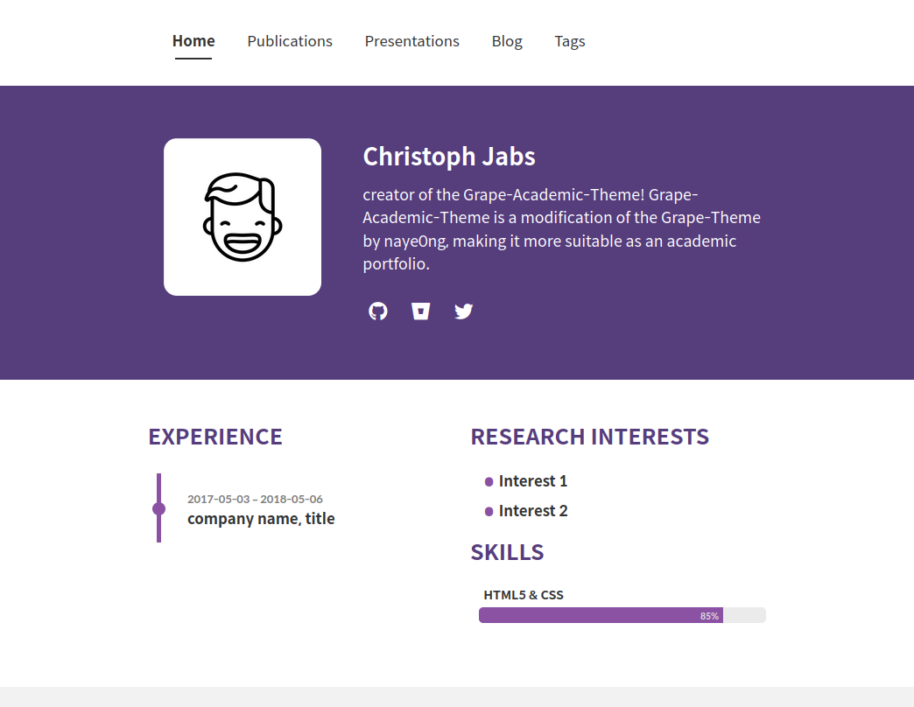
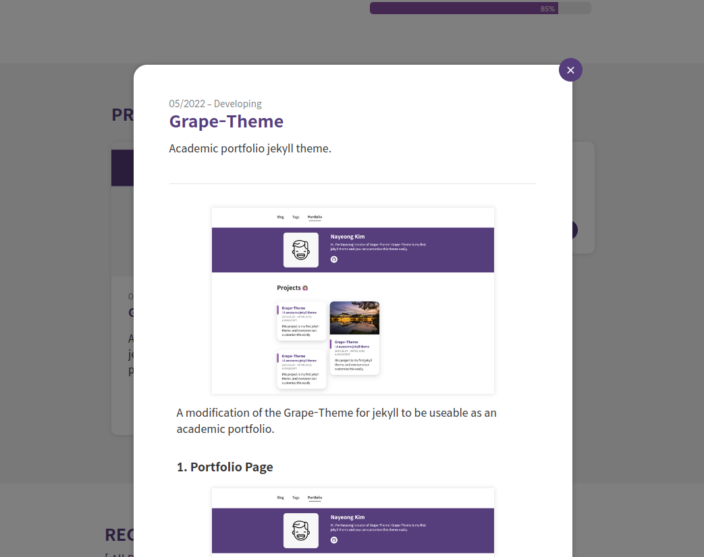

# Grape-Theme


Welcome to Grape Academic Theme!
This theme is based on [Grape Theme](https://github.com/naye0ng/Grape-Theme) and modifies it to be more directly applicable as an academic portfolio page.
It can still include a blog, but that is optional.

[Demo](https://grape-theme.netlify.com)

## Installation

1. Fork and clone the Grape Academic Theme repo

   ```
   git clone https://github.com/chrjabs/Grape-Academic-Theme.git
   ```

2. Install Jekyll 

   ```
   gem install jekyll
   ```

3. Install the theme's dependencies

   ```
   bundle install
   ```

4. Update `_config.yml` and `projects.yml` with your own settings.

5. Run the Jekyll server

   ```
   bundle exec jekyll serve
   ```

## Customizing

Grape-Theme has two great features: the profile section and the project section of the portfolio page. Just by changing `_config.yml` and `projects.yml`, you can use all of these features.

### Blog Settings

The blog configuration is available in `_config.yml`.
If you do not want to include a blog in your page, set `blog: False`.
This will remove the navigation bar linking to the blog.

### Site configuration

```
baseurl: "{subpath}"
url: "https://{username}.github.io"

theme_settings :
  title: {blog title}
```

### Profile Settings

Profile is displayed on the index page, and also experience and skills are displayed on the portfolio page.

```
profile:
  image: assets/img/{prorile image}
    username: {username}
    description: 
    experience:
      - start:
        end: 
        experience: {company name}, {title}
     skills: 
      - skill: 
        value: 85  # Percent value
```

### Pagination

Defines the number of posts to be shown on one page.

```
paginate: 5
```

### Portfolio Settings



The Project configuration is available in `_data/projects.yml`.

The portfolio page provides projects and detailed views by modal.
If `modal : False` is selected, modal will not be displayed on site. 

- **print** : 
  
  - If `print: True` is selected, it will be displayed on landing page
  
   
  
- **modal** 
  
  - If `modal: True` is selected, modal will be displayed on the Portfolio page
  
    

```
print: True
modal: True  
```

Add details(link, description) about your projects

```
url: https://github.com/naye0ng/Grape-Theme # Full URL
image: "portfolio.png" # path: assets/project/
date: 2019.06.09 - 2019.07.11
title: 
summary: 
description:  
# modal contents
contents:
  - title:
    image:      	    
    description: 
```

### Colors

You can change colors at once. colors are in `_sass/base/_variable.scss`

## Posts in Grape theme

You can confirm how to draw tags at [here](https://grape-theme.netlify.com/2019/06/08/markdown-and-html.html) and [here](https://grape-theme.netlify.com/2019/06/09/grape-theme-style.html)

### Create a new post

1. Create a `.md` inside `_posts` folder
   ```
   2019-07-11-grape-theme.md
   ```

2. Write the [Front Matter](https://jekyllrb.com/docs/front-matter/) and content in the file.
   ```
   ---
   layout: post
   title: title
   subtitle : subtitle
   tags: [tag1, tag2]
   author: 
   comments : 
   ---
   ```

## License

The theme is available as open source under the terms of the [MIT License](https://opensource.org/licenses/MIT).